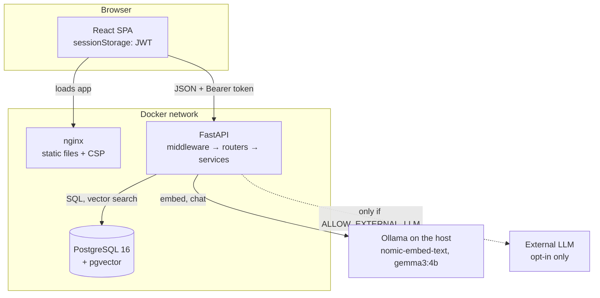
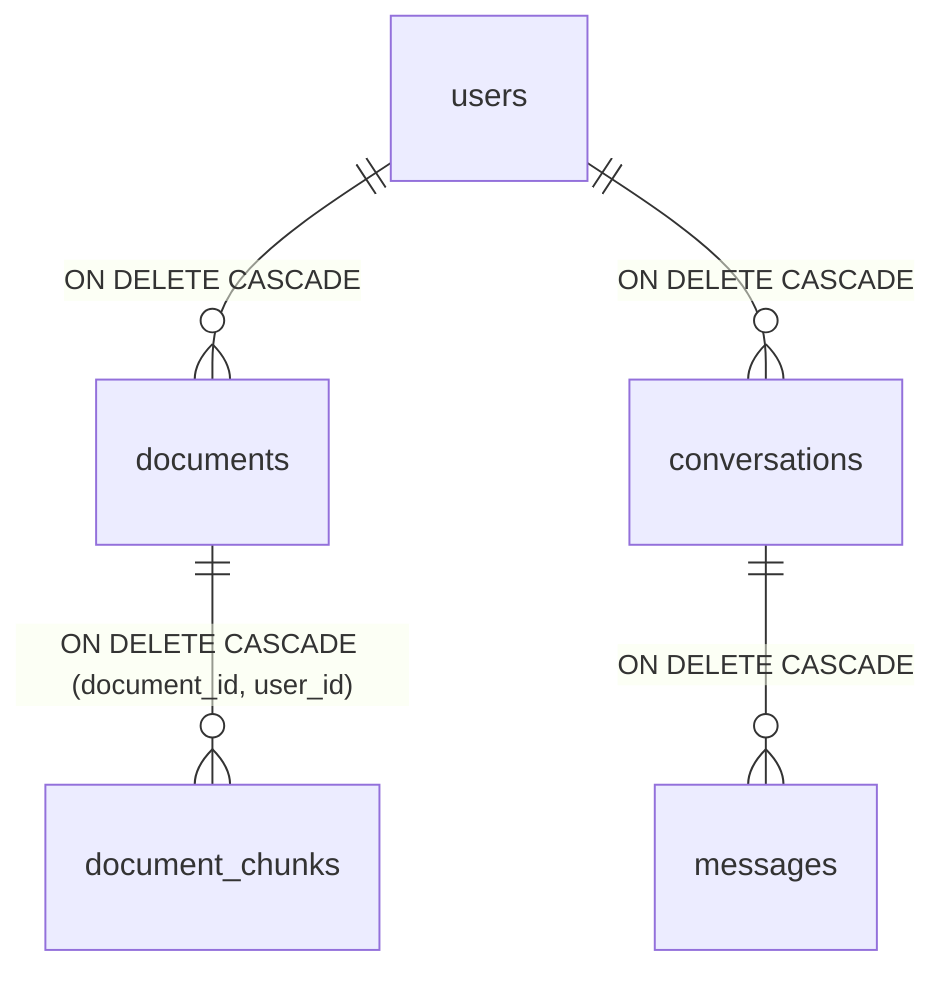
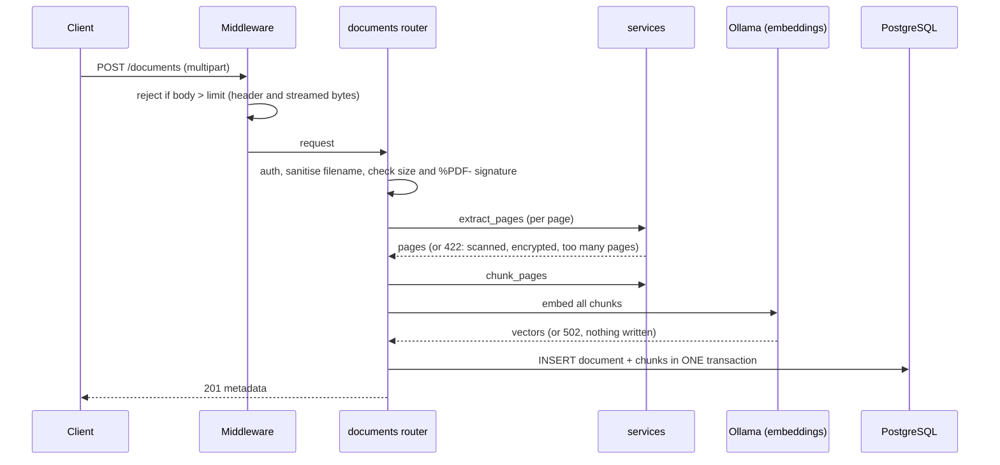

# Architecture

This document explains how the system is put together and *why*. For setup and usage see
[README.md](README.md); for what data is stored see [PRIVACY.md](PRIVACY.md).

## 1. System overview



- The **browser** only talks to two things: nginx (static files) and the API.
- The **API** is the only component with access to the database and to the AI models. It is the
  single place where authentication, authorisation and validation happen.
- The **database** is not reachable from outside the Docker network in the production compose file.
- **Ollama** runs on the host (or as an optional container); document text goes there and nowhere
  else unless an external provider is explicitly enabled.

## 2. Backend structure

```text
HTTP request
   │
   ▼
SecurityHeadersMiddleware → CORSMiddleware → BodySizeLimitMiddleware
   │
   ▼
api/*.py          HTTP only: parse and validate input, check who is asking, call a service,
   │              shape the response and the status code
   ▼
services/*.py     The logic: pdf, chunking, embeddings, search, llm, rag, documents,
   │              retention, privacy. No FastAPI imports for the core pieces.
   ▼
models.py         SQLAlchemy tables; the database enforces constraints and cascades
```

Principles:

- **Routers are thin; logic lives in services**, which are plain functions that take a database
  session and explicit arguments. They can be tested without HTTP and reused (the retention job
  calls the same `delete_document()` as the API).
- **The caller's identity comes from one place**: the `get_current_user` dependency, which verifies the
  token and loads the user. No endpoint reads an owner id from the request body.
- **AI behind interfaces.** `EmbeddingProvider` and `LLMProvider` are small protocols. FastAPI
  injects them, so tests replace them with deterministic fakes and a new provider is one class.
- **Configuration only from the environment** (`config.py`), validated at start-up: the app refuses to
  start with a short JWT secret or an external LLM that was not opted into.

## 3. Data model



See the full column list in the README. Notable decisions:

| Decision | Reason | Trade-off |
|---|---|---|
| UUID primary keys | Ids can't be guessed or enumerated | Larger indexes than integers |
| `ON DELETE CASCADE` everywhere | Erasure is guaranteed by the database; no orphaned embeddings | A bug that deletes a parent is destructive, so deletion paths are tested |
| Composite FK `(document_id, user_id)` on chunks | A chunk cannot belong to another user than its document, even with an application bug | One extra unique constraint on `documents` |
| `user_id` duplicated on chunks | Vector search filters by owner without joining | Denormalisation, kept consistent by the composite FK |
| pgvector inside PostgreSQL | One transaction, one backup, one access-control model; no sync between stores | Less specialised than a dedicated vector database at very large scale |
| HNSW, cosine distance | Fast approximate search; cosine matches how the embeddings are trained | Approximate, uses memory; tuned via `ef_search` if needed |
| `messages.sources` as JSONB snapshot | A chat stays readable without re-querying chunks | Must be pruned when a document is deleted (done) |
| Alembic migrations | Reproducible schema; tests build the database from migrations | Migrations are hand-written for pgvector types |

## 4. Key flows

### 4.1 Uploading a document



Two ordering decisions matter: **embedding happens before any database write**, so a failure leaves
nothing to clean up; and the **document and all its chunks are one transaction**, so a document is
never visible half-processed. The file itself is never written to disk.

### 4.2 Answering a question

1. **Auth and ownership**: the conversation must belong to the caller, otherwise 404.
2. **Condense** (only if the conversation has history): the LLM rewrites "and the second one?" into a
   standalone question. The answer step never sees earlier assistant text, so old answers cannot
   steer new ones. If the rewrite fails, the original question is used.
3. **Retrieve**: embed the question, then `ORDER BY embedding <=> query LIMIT k` with
   `WHERE user_id = :me`. `search_chunks()` *requires* a `user_id` argument; there is no way to call
   it without naming whose data is searched.
4. **Gate**: chunks below the relevance threshold are dropped. Nothing left → fixed "not enough
   information" answer, and **the LLM is never called**.
5. **Generate**: prompt with the question and numbered excerpts in a delimited block; the model must
   cite `[n]` or reply `INSUFFICIENT_CONTEXT`.
6. **Post-process**: empty or citation-only answers count as "no answer"; sources are taken from the
   retrieval, filtered to those cited, and renumbered so `[1]` matches the first source shown.
7. **Persist** question and answer in one transaction. If anything failed earlier, nothing was written,
   so the request can simply be retried.

### 4.3 Retention and deletion

All deletion funnels through `delete_document()`: it prunes the document from the owner's chat
sources, then deletes the row, and the database cascades to chunks and embeddings. User-initiated
deletion, "erase all my data" and the retention sweep all use it or the equivalent cascades, so there
is one definition of "deleted". The sweep runs in a background task every
`RETENTION_SWEEP_MINUTES` and logs only counts.

## 5. Security architecture

Defence in depth, from the edge inward:

| Layer | Control |
|---|---|
| Edge | Security headers on every response (including errors and preflights); strict CSP; request-size limit applied *while streaming*, before buffering; CORS allow-list |
| Identity | bcrypt hashes, JWT (fixed algorithm, expiry, required claims), rate-limited login, uniform error messages and timing |
| Authorisation | Every query filtered by the caller's id; foreign resources answer 404, indistinguishable from missing ones; a test enumerates all routes and fails if one is unauthenticated |
| Input | Pydantic validation; UUID path params; content-signature check on uploads; sanitised filenames; no file ever written to disk |
| Data | Database constraints (composite FK, CHECK, UNIQUE); parameterised SQL only |
| AI | Documents are untrusted data in a delimited block; sources come from retrieval, never from model text; external LLM requires explicit opt-in; the API key is a `SecretStr` and never appears in errors |
| Output | JSON with `nosniff`; React escapes everything; model text is rendered as text nodes only |
| Runtime | Non-root, read-only, capability-less containers; database not published; generic 500s |
| Pipeline | Lint with security rules, dependency scans, tests on a real database before anything is built |

**Trust boundaries.** The browser is untrusted: validation and access control are never only in the
UI. Uploaded PDFs are untrusted. The *language model output* is untrusted too: it is never executed,
never rendered as HTML, and never used to decide which data a user may see.

**Token storage.** The JWT lives in `sessionStorage` (cleared when the tab closes). The strict CSP
(scripts only from our own origin, no inline script) is the protection against XSS reading it. A
`httpOnly` cookie would be stronger against XSS but would require CSRF protection; this is a conscious
trade-off for a Bearer-token API and is listed in the README's limitations.

## 6. Key decisions (short ADRs)

1. **Local-first AI.** *Decision:* Ollama by default. *Why:* the whole point of the privacy design is
   that documents need not leave the machine. *Consequence:* quality is bounded by small local models,
   and answers take seconds. An OpenAI-compatible provider exists behind the same interface.
2. **A relevance gate before the model.** *Why:* the cheapest way to avoid hallucination is to not
   ask when nothing relevant was found. *Evidence:* measured scores overlapped narrowly, so the model-side
   `INSUFFICIENT_CONTEXT` refusal is the second layer.
3. **Chunks never cross pages.** *Why:* each chunk then has exactly one page number, so citations are
   exact. *Cost:* an idea that spans a page break is split (mitigated by overlap within a page).
4. **Synchronous ingestion.** *Why:* simple, and it makes "all or nothing" a single transaction.
   *Cost:* large uploads hold a request open. The upgrade path is a job queue with a status field
   (the `status` column already exists).
5. **Standalone-question rewriting instead of passing history to the answer step.** *Why:* retrieval
   needs a self-contained query, and keeping old assistant text out of the final prompt reduces drift
   and prompt-injection carry-over. *Cost:* one extra model call for follow-ups.
6. **Tests against a real database; AI faked.** *Why:* the risky parts (constraints, cascades, vector
   SQL, migrations) are database behaviour that mocks cannot verify, whereas model behaviour is
   non-deterministic and slow. A bag-of-words fake embedder makes ranking tests meaningful.
7. **Two compose files instead of one with overrides.** *Why:* list-valued keys such as `ports` merge
   by concatenation, so an override file cannot remove a published port. Two explicit files make the
   production hardening obvious at a glance.
8. **Configuration validated at start-up.** *Why:* a misconfigured security setting (short secret,
   accidental external LLM) should stop the app, not silently weaken it.

## 7. Deployment

| | Development (`docker-compose.yml`) | Production-like (`docker-compose.prod.yml`) |
|---|---|---|
| Backend | same image, `--reload`, source mounted read-only | immutable image, no reload |
| Frontend | Vite dev server (HMR) | static build behind unprivileged nginx |
| Database port | published for psql and tests | **not published** |
| Containers | defaults | non-root, read-only filesystem, `cap_drop: ALL`, `no-new-privileges`, `tmpfs` for `/tmp` |
| Health | database, backend (`/health`), frontend | same; start-up order follows health |

Migrations run when the backend container starts (`alembic upgrade head`), which is fine for one
instance. With several replicas, run them as a separate one-off job to avoid races.

## 8. Scaling and limits

- **Vector search** scales with HNSW; memory use grows with the number of chunks. The iterative-scan
  setting keeps filtered queries complete when one user dominates the index.
- **The API is stateless** except for the in-memory rate limiter and the retention loop. Horizontal
  scaling needs a shared limiter store (Redis); the retention sweep is idempotent so multiple
  instances running it is safe, just redundant.
- **The bottleneck is the language model**, not the API: a single local model serves one answer at a
  time. Production would need a queue, streaming responses, or a hosted inference endpoint.
- **Embedding model changes** require a new migration (the vector dimension is part of the column type)
  and re-embedding existing documents.

## 9. Testing strategy

- **Unit tests** for pure logic: chunking, PDF extraction and filename sanitising, prompt building,
  citation handling, password and token handling, the embedding and LLM clients (HTTP mocked).
- **Integration tests** (the majority) call the real FastAPI app against a real PostgreSQL with pgvector
  built from the migrations: registration and login, access control, upload, search, RAG, chat,
  retention, export and erasure.
- **Security tests** assert the properties in section 5 directly (headers, CORS, size limits, injection
  payloads, error leakage, rate limits, an authentication check over every route).
- **Frontend tests** (Vitest + Testing Library, `fetch` mocked) cover login and registration, protected
  routes, upload validation, deletion with confirmation, the chat flow including loading, errors and
  retries.
- **CI** runs all of it, builds both images and smoke-tests the production stack end to end.
- **Not covered:** retrieval *quality* (an evaluation set of labelled questions would measure it),
  real-browser automation across browsers, load and soak testing.
