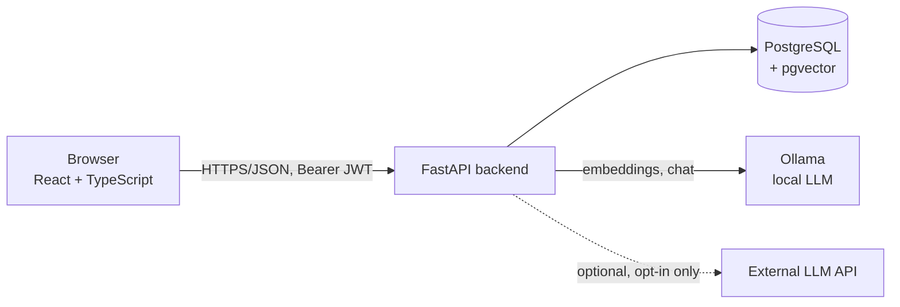
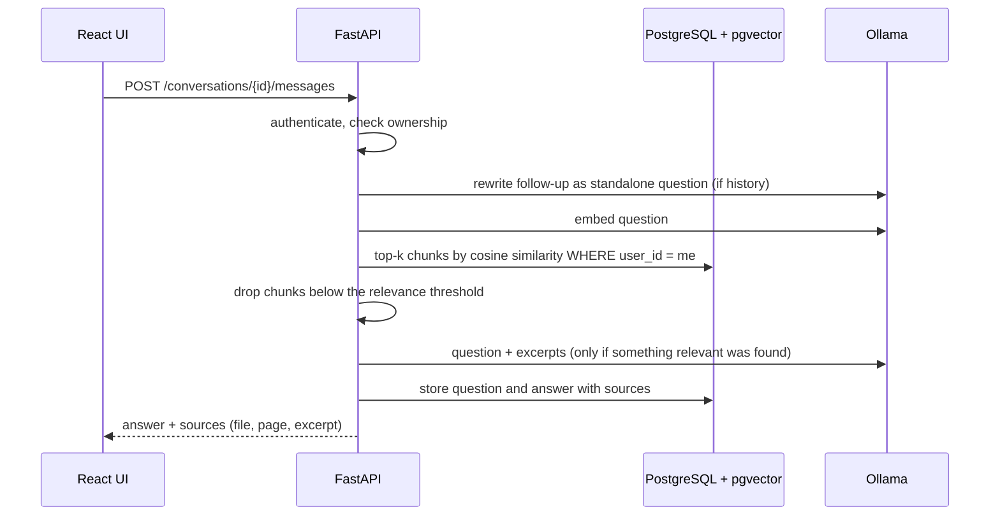
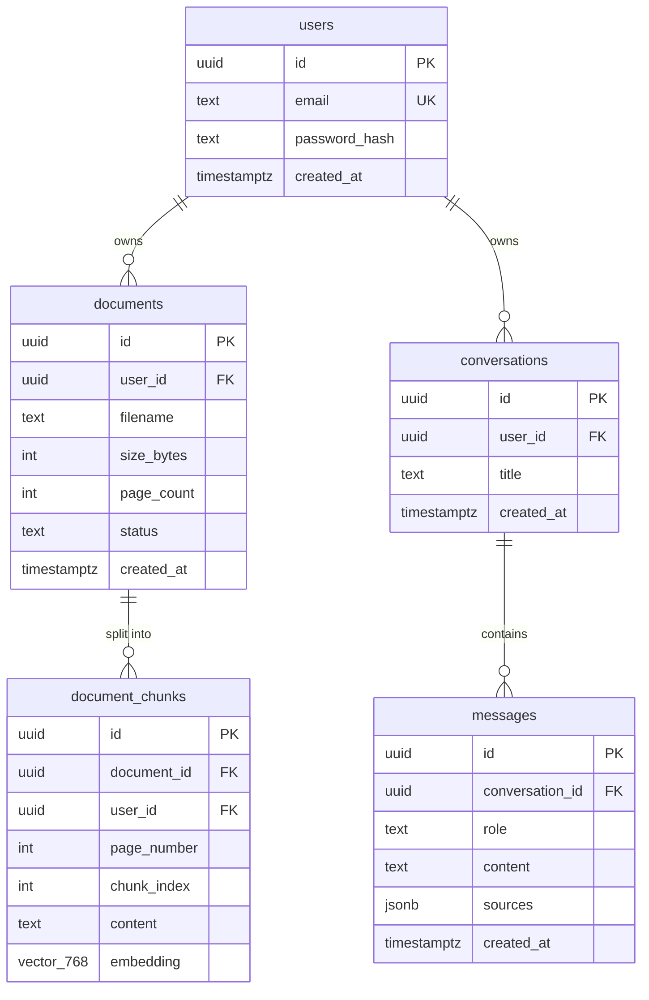

# AI Document Assistant

Upload PDF documents and ask questions about their content. Answers are generated with
**Retrieval-Augmented Generation (RAG)** from the user's own documents only, and every answer
shows **which document and which page** it came from. If the documents do not contain the
answer, the assistant says so instead of making something up.

It runs entirely on your own machine by default (local LLM through [Ollama](https://ollama.com)),
and privacy is part of the design rather than an afterthought: per-user isolation enforced in the
backend, automatic retention, one-click data export and erasure.

> **Technical demonstration.** This project applies privacy-by-design and security techniques, but
> it does not by itself make a deployment GDPR-compliant. See [PRIVACY.md](PRIVACY.md).

## Quick start

You need [Docker Desktop](https://www.docker.com/products/docker-desktop/) and
[Ollama](https://ollama.com). Then:

```bash
ollama pull nomic-embed-text     # embeddings
ollama pull gemma3:4b            # answers
cp .env.example .env             # then edit .env: set POSTGRES_PASSWORD (also inside
                                 # DATABASE_URL) and JWT_SECRET (32+ random characters)
docker compose up --build
```

Open <http://localhost:5173>, create an account, upload a PDF, and start a conversation.
Generate a secret with `python -c "import secrets; print(secrets.token_hex(32))"`.
Details and troubleshooting: [How to run locally](#how-to-run-locally).

## Contents

1. [Features](#features)
2. [Architecture](#architecture)
3. [Technology stack](#technology-stack)
4. [Database architecture](#database-architecture)
5. [RAG pipeline](#rag-pipeline)
6. [GDPR and privacy](#gdpr-and-privacy)
7. [Security](#security)
8. [API documentation](#api-documentation)
9. [Testing](#testing)
10. [Docker setup](#docker-setup)
11. [Environment variables](#environment-variables)
12. [How to run locally](#how-to-run-locally)
13. [Project structure](#project-structure)
14. [Limitations](#limitations)
15. [Future improvements](#future-improvements)

More detail: [ARCHITECTURE.md](ARCHITECTURE.md) (design and decisions) and
[PRIVACY.md](PRIVACY.md) (what is stored, for how long, what leaves the machine).

## Features

- **Accounts.** Register, log in (JWT), per-user access control. Users only ever see their own data.
- **Documents.** Upload PDFs (validated by content, not just extension), list, view metadata, delete.
  Text is extracted page by page, chunked, embedded and stored. The original file is *not* kept.
- **Semantic search.** Find passages by meaning, ranked by relevance, with document and page.
- **Chat.** Multiple conversations with history. Follow-up questions ("and the open-closed one?")
  work because they are rewritten into standalone questions before retrieval.
- **Cited sources.** Every answer lists its sources as *file name, page*. Click one to see the exact
  excerpt and open the document.
- **Honest "I don't know".** Weak matches never reach the language model, and the model is told to
  refuse when the excerpts do not contain the answer.
- **Dashboard.** Document and conversation counts, latest uploads, search, new conversation.
- **Privacy tools.** Automatic deletion after a retention period, download all my data (JSON),
  erase my data, delete my account. Each destructive action asks for the password again.
- **Pluggable AI.** Local Ollama by default. An external OpenAI-compatible provider is supported but
  refuses to start unless explicitly enabled.

## Architecture



Request flow for a question:



The backend is layered: `api/` (HTTP, validation, access checks) → `services/` (PDF, chunking,
embeddings, search, RAG, retention, privacy) → `models.py` (database). AI providers sit behind small
interfaces (`EmbeddingProvider`, `LLMProvider`) so they can be swapped and faked in tests. See
[ARCHITECTURE.md](ARCHITECTURE.md).

## Technology stack

| Area | Technology |
|---|---|
| Backend | Python 3.12, FastAPI, SQLAlchemy 2, Pydantic v2, Alembic, pytest |
| Database | PostgreSQL 16 with the **pgvector** extension (HNSW index) |
| Auth and security | bcrypt, PyJWT, slowapi (rate limiting), custom security-header and body-size middleware |
| PDF | pypdf |
| AI | Ollama: `nomic-embed-text` (768-dim embeddings), `gemma3:4b` (answers); swappable |
| Frontend | React 18, TypeScript, Vite, React Router, Vitest + Testing Library |
| DevOps | Docker, Docker Compose, GitHub Actions, ruff (incl. security rules), pip-audit, npm audit |

## Database architecture



Why it looks like this:

- **Everything hangs off `users` with `ON DELETE CASCADE`.** Deleting a document, a conversation or an
  account removes all dependent rows, including embeddings, in one statement. Erasure is enforced
  by the database, not by remembering to delete things in application code.
- **A composite foreign key on `document_chunks`** `(document_id, user_id) → documents(id, user_id)`
  makes it *impossible* for a chunk to belong to a different user than its document, even if
  application code had a bug. `user_id` is also stored on the chunk so vector search can filter by
  owner without a join.
- **UUID primary keys** so ids cannot be guessed or enumerated.
- **`CHECK` constraints** on `status` and `role`, a **`UNIQUE`** constraint on `email`, and
  `UNIQUE (document_id, chunk_index)`.
- **pgvector in the same database** keeps user data and embeddings under one transaction, one
  backup and one access-control model, instead of syncing a separate vector store.
- **HNSW index** (`vector_cosine_ops`) for fast approximate nearest-neighbour search; queries use
  pgvector's iterative scan so a user with little data still gets full results when other users
  have much more.
- **`messages.sources` is a JSONB snapshot** (file name, page, excerpt) so a chat stays readable;
  when a document is deleted its entries are pruned from the history (`services/documents.py`).

Schema changes are versioned with Alembic (`backend/alembic/versions`) and applied on start-up.

## RAG pipeline

**Ingestion** (on upload, one transaction, all or nothing):

1. Validate: `.pdf` name, `%PDF-` content signature, size limit, page limit, not encrypted.
2. Extract text **per page** (pypdf), so each chunk has exactly one page number for citations.
3. Chunk: sentence-aware, ≤ 1000 characters, 150 characters of overlap, never across pages.
4. Embed every chunk with `nomic-embed-text` (768 dimensions) *before* touching the database.
5. Store document metadata, chunks and embeddings, all linked to the user.

**Question answering:**

1. If the conversation has history, the LLM rewrites a follow-up into a standalone question.
2. Embed the question and run a cosine-similarity search restricted to the current user.
3. Keep chunks scoring ≥ `RAG_MIN_SCORE` (0.60). If none remain, answer "not enough information"
   **without calling the LLM**.
4. Build the prompt: strict instructions, the question, and numbered excerpts inside a delimited
   `<context>` block (treated as untrusted data).
5. The model answers only from the excerpts and cites them as `[1]`, `[2]`, or replies
   `INSUFFICIENT_CONTEXT`, which becomes the fixed "not enough information" answer.
6. Sources shown to the user come from the retrieval, never from model output; they are filtered to
   the ones actually cited and renumbered to match the text.

The relevance threshold was measured, not guessed: on `nomic-embed-text`, relevant questions scored
0.64–0.88 and unrelated ones 0.48–0.60, so a threshold alone is not enough and the model-side refusal
is the second layer.

## GDPR and privacy

Short version (full detail in [PRIVACY.md](PRIVACY.md)):

- **Data minimisation:** the original PDF is never stored; no analytics or tracking.
- **Access control in the backend:** every query is scoped by the user id from the verified token.
  Other users' data is indistinguishable from data that does not exist (404).
- **Deletion:** per document, per conversation, all my data, or my account. The database cascades.
- **Retention:** documents and conversations are deleted automatically after 90 days by default
  (configurable); every document shows when it will be deleted.
- **Access and portability:** `GET /users/me/export`.
- **Local by default:** with Ollama, no document text leaves your machine. An external LLM must be
  explicitly enabled (`ALLOW_EXTERNAL_LLM=true`), otherwise the app refuses to start.
- **Secrets** live in `.env` (git-ignored), never in code.

## Security

| Concern | Measure |
|---|---|
| Authentication | bcrypt (salted) password hashes; JWT with fixed algorithm and expiry; login gives the same message and takes similar time whether or not the account exists |
| Authorisation | All data access scoped by `user_id` in the backend; a test walks **every route** and fails if one is reachable without a token |
| Input validation | Pydantic schemas on every endpoint; length limits; UUID path parameters |
| File upload | Content-signature check, size and page limits, filename sanitising, file never written to disk, request size enforced while streaming |
| SQL injection | SQLAlchemy parameterised queries only; injection payloads are tested |
| XSS | JSON API with `nosniff` and CSP; React escapes output; model output is rendered as text, never HTML; no inline styles/scripts so a strict CSP works |
| CORS | Explicit origin allow-list, only the needed methods and headers, no wildcard, no credentials mode |
| Rate limiting | Login/register, upload, search, ask, export and account deletion |
| Prompt injection | Documents are treated as untrusted data in a delimited block; they cannot close the block or alter the system prompt |
| Secrets | `.env`, environment variables, a minimum JWT secret length enforced at start-up |
| Containers | Non-root, read-only filesystem, no capabilities, database port not published (production compose file) |
| Supply chain | `pip-audit` and `npm audit` in CI; dependencies were upgraded after audits found known CVEs |
| Errors | Generic 500 responses; no stack traces or internals to the client |

See "Limitations" for what is deliberately not covered.

## API documentation

Interactive docs (Swagger UI): <http://localhost:8000/docs>. All endpoints except the first three
require `Authorization: Bearer <token>`.

| Method | Path | Description | Success |
|---|---|---|---|
| GET | `/health` | API, database and pgvector status | 200 |
| POST | `/auth/register` | Create an account | 201 |
| POST | `/auth/login` | Returns a JWT | 200 |
| GET | `/users/me` | Current user | 200 |
| GET | `/users/me/export` | Download all my data (`?include_document_text=true`) | 200 |
| DELETE | `/users/me/data` | Erase my documents and conversations (password in body) | 200 |
| DELETE | `/users/me` | Delete my account (password in body) | 204 |
| POST | `/documents` | Upload a PDF (multipart) | 201 |
| GET | `/documents` | List my documents | 200 |
| GET | `/documents/{id}` | Document metadata | 200 |
| DELETE | `/documents/{id}` | Delete a document and everything derived from it | 204 |
| POST | `/search` | Semantic search `{query, limit, document_id?}` | 200 |
| POST | `/ask` | One-off question with sources | 200 |
| POST | `/conversations` | New conversation | 201 |
| GET | `/conversations` | My conversations, most recent first | 200 |
| GET | `/conversations/{id}` | Conversation with messages and sources | 200 |
| POST | `/conversations/{id}/messages` | Ask a question, returns the answer with sources | 201 |
| DELETE | `/conversations/{id}` | Delete a conversation | 204 |

Common errors: `401` not authenticated, `403` wrong password on a destructive action, `404` not
found *or not yours*, `413` too large, `415` not a PDF, `422` invalid input, `429` rate limited,
`502` the embedding or language model is unavailable.

## Testing

```bash
# backend: needs PostgreSQL with pgvector (docker compose up -d postgres)
cd backend
python -m venv .venv && .venv\Scripts\activate     # Linux/macOS: source .venv/bin/activate
pip install -r requirements-dev.txt
pytest --cov                    # 202 tests, ~97 % coverage
ruff check app tests alembic    # lint, including security rules

# frontend
cd frontend
npm ci
npm run typecheck && npm test   # 41 tests
```

- **Integration tests run against a real PostgreSQL + pgvector**, rebuilt from the Alembic
  migrations, so migrations, cascades, constraints and vector queries are tested for real.
- **AI is faked in tests** (deterministic bag-of-words embeddings, scripted LLM) so the suite is
  fast and offline. One optional smoke test uses a real Ollama and is skipped if it is not running.
- **Security tests** cover headers, CORS, request-size limits, SQL-injection and XSS payloads, error
  leakage, rate limiting, malformed auth headers, and user-A-versus-user-B access to every resource.
- **Privacy tests** prove that deleting a document removes its chunks, embeddings and chat sources,
  and that deleting a user removes everything.
- The test database credentials are read from `.env`; set `TEST_DATABASE_URL` to override.
- **CI** (`.github/workflows/ci.yml`) runs lint and tests (fails below 90 % coverage), builds the
  frontend, scans dependencies, then builds the production Docker stack and smoke-tests it.

## Docker setup

Two compose files:

| File | Purpose | Start |
|---|---|---|
| `docker-compose.yml` | **Development**: hot reload, database port published for tools | `docker compose up --build` |
| `docker-compose.prod.yml` | **Production-like**: built images, hardened containers, nothing but the web ports published | `docker compose -f docker-compose.prod.yml up -d --build` |

Services: `postgres` (pgvector image), `backend` (FastAPI), `frontend` (Vite in dev, static files
behind unprivileged nginx in production) and an optional `ollama` container
(`--profile local-llm`). To use the container instead of an Ollama installed on your machine, set
`OLLAMA_BASE_URL=http://ollama:11434` in `.env`, start it with `docker compose --profile local-llm up`,
and pull the models *inside* it (they are stored in a Docker volume):

```bash
docker compose exec ollama ollama pull nomic-embed-text
docker compose exec ollama ollama pull gemma3:4b
```

The production file has no TLS: put a reverse proxy in front of it before exposing it publicly.

## Environment variables

Copy `.env.example` to `.env`. The most important ones:

| Variable | Default | Meaning |
|---|---|---|
| `POSTGRES_USER`, `POSTGRES_PASSWORD`, `POSTGRES_DB` | `docai`, `change-me`, `docai` | Database credentials (change the password!) |
| `DATABASE_URL` | see example | Must use the same password; host is `postgres` inside Docker |
| `JWT_SECRET` | *(required, ≥ 32 chars)* | Generate: `python -c "import secrets; print(secrets.token_hex(32))"` |
| `ACCESS_TOKEN_EXPIRE_MINUTES` | `60` | Login lifetime |
| `CORS_ORIGINS` | `http://localhost:5173` | Allowed frontend origins (comma separated) |
| `VITE_API_URL` | `http://localhost:8000` | API address used by the browser |
| `OLLAMA_BASE_URL` | `http://host.docker.internal:11434` | Where the backend reaches Ollama |
| `EMBEDDING_MODEL`, `LLM_MODEL` | `nomic-embed-text`, `gemma3:4b` | Models |
| `LLM_PROVIDER`, `ALLOW_EXTERNAL_LLM`, `LLM_BASE_URL`, `LLM_API_KEY` | `ollama`, `false` | External provider settings (opt-in) |
| `RAG_MIN_SCORE`, `RAG_TOP_K` | `0.60`, `5` | Relevance threshold and number of excerpts |
| `CHUNK_SIZE`, `CHUNK_OVERLAP` | `1000`, `150` | Chunking (characters) |
| `MAX_UPLOAD_MB`, `MAX_PDF_PAGES` | `20`, `500` | Upload limits |
| `DOCUMENT_RETENTION_DAYS`, `CONVERSATION_RETENTION_DAYS` | `90`, `90` | Automatic deletion (`0` = off) |
| `RETENTION_SWEEP_MINUTES` | `60` | How often the retention job runs (`0` = off) |
| `*_RATE_LIMIT`, `RATE_LIMIT_ENABLED` | e.g. `5/minute` | Rate limits |
| `HSTS_ENABLED` | `false` | Turn on when served over HTTPS |

All settings, with defaults, are in `backend/app/config.py`.

## How to run locally

**Prerequisites:** Docker Desktop, [Ollama](https://ollama.com). For development without Docker:
Python 3.12+ and Node 20+.

```bash
# 1. Models (one time)
ollama pull nomic-embed-text
ollama pull gemma3:4b

# 2. Configuration
cp .env.example .env
#    edit .env: set POSTGRES_PASSWORD (and the same password in DATABASE_URL)
#    and JWT_SECRET (at least 32 random characters)

# 3. Start everything
docker compose up --build
```

Open <http://localhost:5173>, create an account, upload a PDF and ask a question.
API docs: <http://localhost:8000/docs>.

**Backend without Docker** (database still in Docker):

```bash
docker compose up -d postgres
cd backend
python -m venv .venv && .venv\Scripts\activate
pip install -r requirements-dev.txt
#  create backend/.env with DATABASE_URL pointing to localhost, e.g.
#  DATABASE_URL=postgresql+psycopg://docai:<password>@localhost:5432/docai  and JWT_SECRET=...
alembic upgrade head
uvicorn app.main:app --reload
```

**Frontend without Docker:** `cd frontend && npm ci && npm run dev`.

**Troubleshooting**

- *Backend exits immediately:* check `docker compose logs backend`. A `JWT_SECRET` shorter than 32
  characters is refused on purpose.
- *`password authentication failed`:* the database keeps the password it was first created with.
  Either use that one, or reset a throwaway database with `docker compose down -v`.
- *502 when uploading or asking:* Ollama is not running, or the models are not pulled.
- *Tests time out connecting:* start the database (`docker compose up -d postgres`).

## Project structure

```text
.
├── docker-compose.yml          # development stack
├── docker-compose.prod.yml     # production-like, hardened stack
├── .env.example                # all configuration, placeholders only
├── PRIVACY.md  ARCHITECTURE.md README.md
├── .github/workflows/ci.yml    # lint, test, build, scan, smoke test
├── db/init/                    # creates the pgvector extension
├── backend/
│   ├── Dockerfile  requirements.txt  requirements-dev.txt  pyproject.toml
│   ├── alembic/versions/       # 0001 schema, 0002 HNSW index
│   ├── app/
│   │   ├── main.py             # app, middleware, routers, retention job
│   │   ├── config.py           # all settings (environment variables)
│   │   ├── models.py  schemas.py  database.py  deps.py  security.py
│   │   ├── middleware.py       # security headers, request-size limit
│   │   ├── rate_limit.py
│   │   ├── api/                # auth, users, documents, search, ask, conversations, health
│   │   └── services/           # pdf, chunking, embeddings, search, llm, rag,
│   │                           # documents (deletion), retention, privacy (export/erase)
│   └── tests/                  # 202 tests; fakes.py replaces the AI services
└── frontend/
    ├── Dockerfile  Dockerfile.dev  nginx/default.conf.template
    └── src/
        ├── api.ts  auth.tsx  hooks.ts  format.ts  styles.css
        ├── components/         # Layout, RequireAuth, ConfirmDialog, SearchBox, MessageBubble, Composer ...
        ├── pages/              # AuthPage, Dashboard, Documents, DocumentDetail, ChatPage, Account
        └── test/  *.test.ts(x) # 41 tests
```

## Limitations

Honest list of what this is not:

- **Not legally certified.** See the notice at the top and in [PRIVACY.md](PRIVACY.md).
- **Scanned PDFs are rejected** (no OCR). Tables and multi-column layouts may extract poorly.
- **Language.** `nomic-embed-text` works best in English. Norwegian works, with lower similarity
  scores (the threshold is a compromise). A multilingual embedding model would improve this.
- **A 4B-parameter model makes mistakes.** Refusal and citation behaviour are reinforced in code,
  but not guaranteed.
- **Processing is synchronous.** A large PDF keeps the upload request open while it is embedded.
- **No server-side logout or token revocation.** "Log out" discards the token in the browser; a copy
  of it stays valid until it expires (60 minutes). There is no e-mail verification or password reset.
- **The token is kept in `sessionStorage`**, protected mainly by the strict Content-Security-Policy.
  A `httpOnly` cookie would be stronger against XSS but needs CSRF protection (see
  [ARCHITECTURE.md](ARCHITECTURE.md#5-security-architecture)).
- **Rate limiting is per IP and in memory**, which is fine for one instance. Behind a proxy it needs
  trusted-proxy configuration, and several instances need a shared store such as Redis.
- **PDF parsing of hostile files** is bounded by size and page limits, not sandboxed.
- **Backups and encryption at rest** are not part of this project.

## Future improvements

- OCR for scanned documents; layout-aware extraction for tables.
- Background ingestion with progress reporting; streaming answers (server-sent events).
- Hybrid search (keyword + vector) and re-ranking; a multilingual embedding model.
- A small evaluation harness (labelled questions) to measure retrieval and answer quality.
- Per-document and per-folder scope in the chat UI (the API already supports `document_id`).
- Token refresh and revocation, e-mail verification, password reset, optional 2FA.
- Redis-backed rate limiting; structured logging, metrics and tracing.
- Playwright end-to-end tests; Docker secrets or a secrets manager; TLS termination in the stack.
